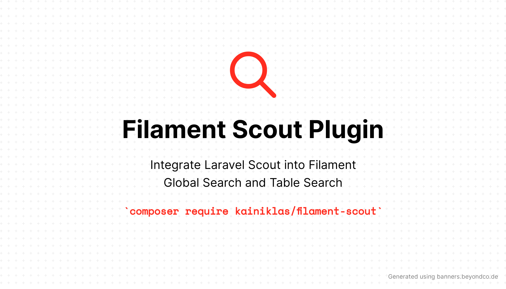

# Filament Scout Plugin

[](https://packagist.org/packages/kainiklas/filament-scout)
[](https://github.com/kainiklas/filament-scout/actions?query=workflow%3Arun-tests+branch%3Amain)
[](https://github.com/kainiklas/filament-scout/actions?query=workflow%3A"Fix+PHP+code+styling"+branch%3Amain)
[](https://packagist.org/packages/kainiklas/filament-scout)



Plugin to integrate Laravel Scout into Filament Global Search and Table Search.

## Pre-Requesites

- [Laravel Scout](https://laravel.com/docs/10.x/scout): Install and configure Laravel Scout as described in the Laravel Docs.

## Installation

You can install the package via composer:

```bash
composer require kainiklas/filament-scout
```

## Usage

### Enable Table Search for Resources

To use Scout Search instead of the default search, add the trait `InteractsWithScout` to any Page which contains a table, e.g. `app\Filament\Resources\MyResource\Pages\ListMyResources.php`:

```php
use Kainiklas\FilamentScout\Traits\InteractsWithScout;

class ListMyResources extends ListRecords
{
    use InteractsWithScout;

    protected static string $resource = MyResource::class;

    protected function getHeaderActions(): array
    {
        return [
            Actions\CreateAction::make(),
        ];
    }

}
```

### Enable Global Search

1. Check how to enable [Global Search in the Filament Documentation](https://filamentphp.com/docs/3.x/panels/resources/global-search). It is sufficient to add `searchable()` to the table as described [here](https://filamentphp.com/docs/3.x/tables/advanced#searching-records-with-laravel-scout).
2. (Optional) Add Details by implementing the method `getGlobalSearchResultDetails(Model $record)` in your Resource File as described [here](https://filamentphp.com/docs/3.x/panels/resources/global-search#adding-extra-details-to-global-search-results).
3. Add the plugin `FilamentScoutPlugin` to your panel configuration, e.g., in `app\Providers\Filament\AdminPanelProvider.php`.

Example: 

```php
class AdminPanelProvider extends PanelProvider
{
    public function panel(Panel $panel): Panel
    {
        return $panel
            ...
            ->plugin(FilamentScoutPlugin::make())
            ...
    }
}
```

### Meilisearch (BETA)

If you are using [Meilisearch](https://www.meilisearch.com/), you may want to try the plugin `FilamentMeilisearchPlugin` which supports context highlighting.

If you are using "globalSearchResultDetails" you need to adapt this in the following way:

```php
public static function getGlobalSearchResultDetails(Model $record): array
    {
        // return [
        //     'AttributeTitle' => $record->attribute_name
        // ];

        return [
            'attribute_name' => "AttributeTitle"
        ];
```

## Testing

```bash
composer test
```

## Changelog

Please see [CHANGELOG](CHANGELOG.md) for more information on what has changed recently.

## Contributing

Please see [CONTRIBUTING](.github/CONTRIBUTING.md) for details.

## Security Vulnerabilities

Please review [our security policy](../../security/policy) on how to report security vulnerabilities.

## Credits

- [Kai Niklas](https://github.com/kainiklas)

## License

The MIT License (MIT). Please see [License File](LICENSE.md) for more information.
